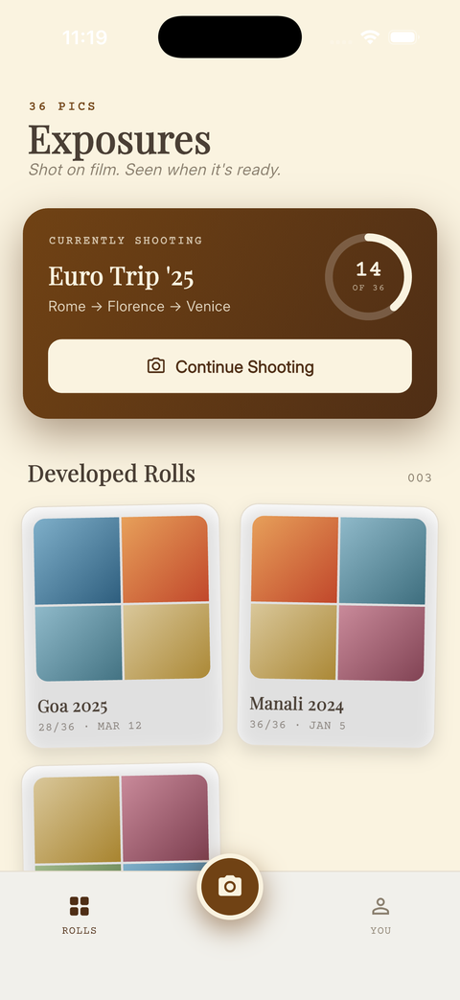
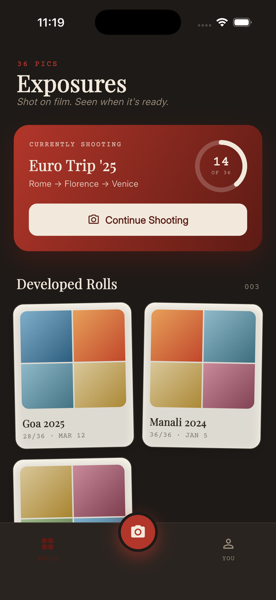
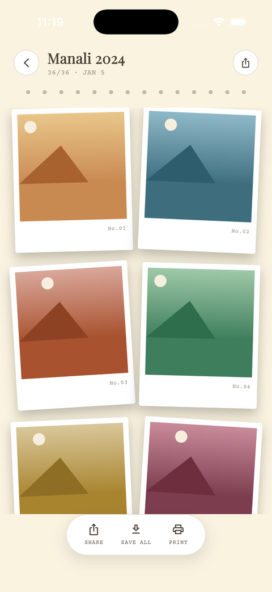
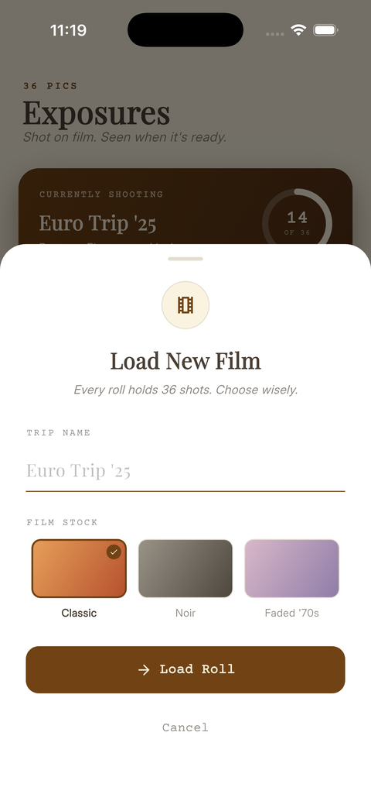
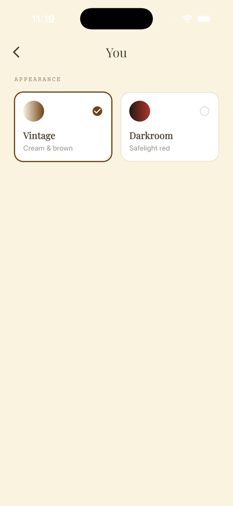
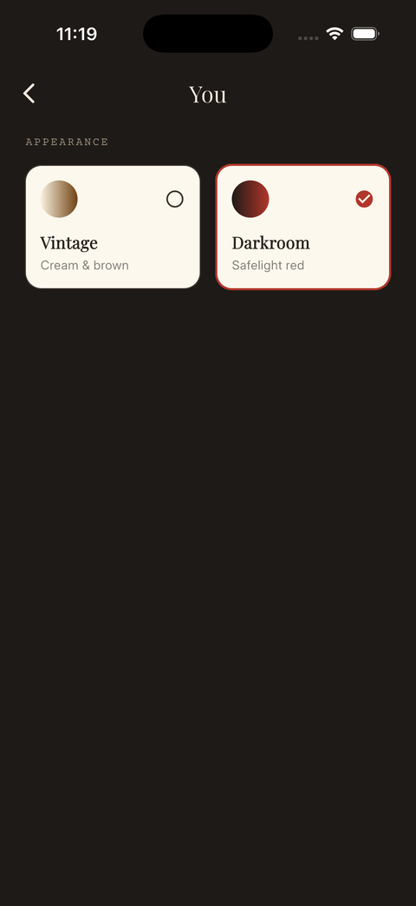

# 📸 36 Pics

A minimalist, disposable-film-camera app for Flutter. Every trip gets **one roll, 36 shots** — load it, shoot it, let it develop, then relive it. No infinite camera roll, no endless scrolling — just the deliberate pace of film.

<p align="center">
  
  
  
  
</p>

---

## 🎯 Concept

On vacations or weekend trips, we often get lost in taking *too many* pictures, losing the moment itself.
**36 Pics** reintroduces that nostalgic constraint — you get **only 36 shots** per trip, so every photo counts. Finish a roll and it has to *develop* before you can see it, just like real film.

> **Load → Shoot → Develop → Relive**

---

## ✨ Features

- 🎞 **One roll per trip** — load new film with a name and a film-stock choice, shoot up to 36 exposures
- 📷 **Real camera viewfinder** — live preview with flash/flip controls and a rule-of-thirds overlay
- 🔢 **Frame-counter dial** — a circular progress ring tracks exposures used, both in the hero card and the camera HUD
- 🧪 **Developing ritual** — finishing a roll doesn't dump you straight into the gallery; it develops first
- 🖼 **Polaroid gallery** — finished rolls render as a grid of rotated polaroid-style prints
- 🎨 **Two themes, your choice** — switch anytime from the **You** tab:
  | Vintage | Darkroom |
  |---|---|
  | Cream & brown, matches classic photo albums | Near-black with safelight red, like standing in a real darkroom |

> This is a **UI/UX prototype** — the camera preview and capture flow are real, but captured frames aren't persisted to device storage yet (gallery content is placeholder art). Real photo storage is the next milestone.

---

## 📱 Screenshots

| Library (Vintage) | Library (Darkroom) |
|---|---|
|  |  |

| Load New Film | Gallery |
|---|---|
|  |  |

| Theme Picker (Vintage) | Theme Picker (Darkroom) |
|---|---|
|  |  |

---

## 🛠 Tech Stack

- [Flutter](https://flutter.dev/) (iOS-first)
- `camera` for the live viewfinder, `permission_handler` for camera access
- Custom `ThemeController` (`ChangeNotifier`) driving a dynamic `AppColors` palette — no external state-management package
- `path_provider`, `gallery_saver`, `uuid` — wired in for the upcoming real photo-storage milestone

---

## 🚀 Getting Started

Clone the repo:

```bash
git clone https://github.com/CovertlyOvert/36-pics.git
cd 36-pics
flutter pub get
flutter run
```

Requires Flutter (stable channel) and, for iOS, Xcode + CocoaPods. Run on a simulator or device — note the camera preview needs a real device to show an actual feed; simulators fall back to a placeholder.
